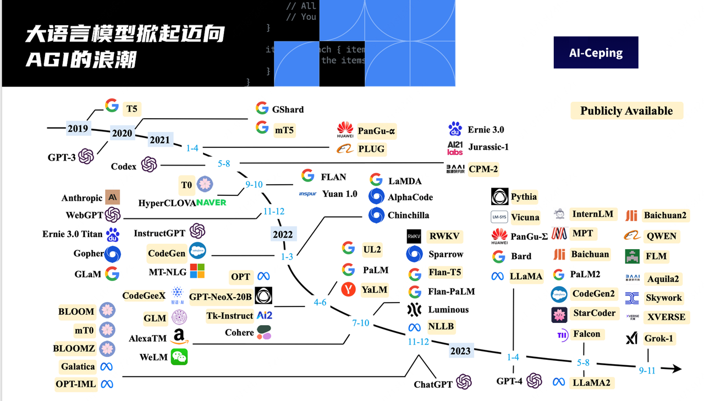
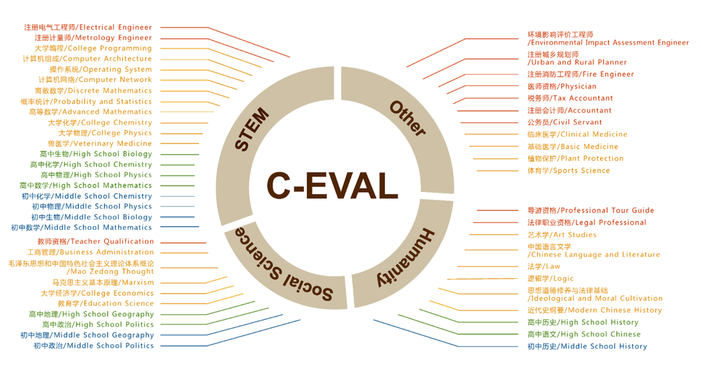
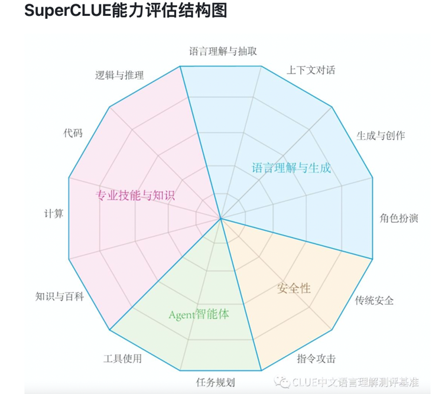

#

## 0.什么是大语言模型？

大语言模型（Large Language Model，简称 LLM）是一种基于深度学习技术的自然语言处理（NLP）模型。它通过学习大量文本数据来理解、生成和翻译自然语言。典型的大语言模型如 OpenAI 的 GPT 系列和 Google 的 BERT 模型，它们能够执行各种语言任务，包括文本生成、语言翻译、文本摘要、问答系统等

## 1.什么是大语言模型评测？

- 大语言模型评测是对大语言模型性能进行系统化和科学化的测试与评估的过程。通过评测，我们可以了解模型在不同语言任务上的表现，判断其优缺点，并发现潜在的问题。这些评测不仅包括准确性和效率等基本指标，还包括模型的鲁棒性、公平性和伦理问题等方面。

## 2.大语言模型评测的意义？

- **衡量性能**：了解模型在不同任务上的表现，以确保其在实际应用中能够达到预期效果。
- **指导改进**：通过评测结果，研究人员可以发现模型的不足之处，并进行针对性的改进和优化。
- **比较不同模型**：通过统一的评测标准，比较不同大语言模型的优劣，帮助用户选择最适合的模型。
- **确保安全与公平**：评测还可以揭示模型在安全性、公平性和伦理道德方面的问题，推动模型在这些方面的改进。

## 3.大语言模型评测的方式？

大语言模型评测可以采用多种方式，包括但不限于：

1. **基准测试（Benchmarking）**：使用一系列标准化的数据集和任务来测试模型的性能。例如，GLUE 和 SuperGLUE 是常用于 NLP 任务的基准测试。
2. **人类评价**：通过人工评审来评估模型生成的文本质量、流畅性和相关性。
3. **实际应用测试**：将模型应用于真实场景中，如客户服务、翻译系统等，观察其实际表现。
4. **对抗测试**：通过设计一些恶意输入或极端情况来测试模型的鲁棒性和稳定性。
5. **公平性和伦理测试**：评估模型在处理不同人群和内容时是否存在偏见，确保其公平和无害。

当下，市面上的评测体系近百个，既有来自专业学术机构的，也有来自市场运作组织的，还有一些媒体也推出了对应的大模型榜单。

## 4.当前大模型评测体系存在诸多问题

- **开源评测数据集题目全公开**

  “刷题”、“背题”现象频发。包括雇佣人类“数据标注员”来做题将答案给到大模型，让 GPT-4 来答题再将答案用来训练自家大模型，大模型做题就可以“满分”了。

- **评测数据集本身不科学**

  没有科学合理的设置“考题”去评测大模的各项能力，题目设置过于随意。以及场景错位，比如用中文数据集去考核英文大模型，跟让老外直接来参加高考一样不靠谱；

- **评测体系不完善**

  大部分评测体系是从知识面的角度去考察大模型，缺少对大模型能力的评测和深入分析。使得评测和大模型的研究割裂，无法指导未来的研究。

- **信息良莠不齐**

  据不完全统计，国产大模型已经超过 180 个。多家国产大模型号称在多个维度已超越 OpenAI 旗下的 GPT-4，且有模有样地晒出对应的大模型评测榜单“跑分”，比如某大模型宣称“基模型 12 项性能超越 GPT-4”。这么多大模型，哪些是真的效果好？在每天冒出来的各类“榜单”上出现了“家家第一”的情况，甚至已不止一款国产大模型“碾压”了 GPT-4？为什么在榜单上这么强，但是实际用起来却远不如 GPT-4？

## 5.社群目标

**通过 [AI-Ceping](https://ai-ceping.com/) 平台 的用户视角，搭建全新的、与时俱进的大模型评测体系**

- 准确、靠谱、权威的评测体系，可以科学、全面、有效地衡量大模型
- 评测试题隐私、公正，避免大模型在训练中见过以及背题。
- 具有指导意义的评测。针对性的评价大模型的各项能力，指导未来大模型的研究方向
